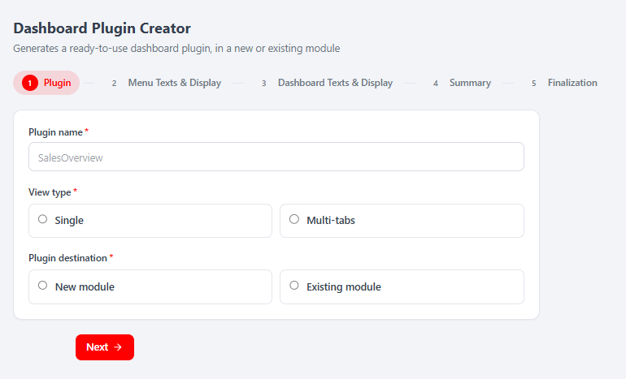
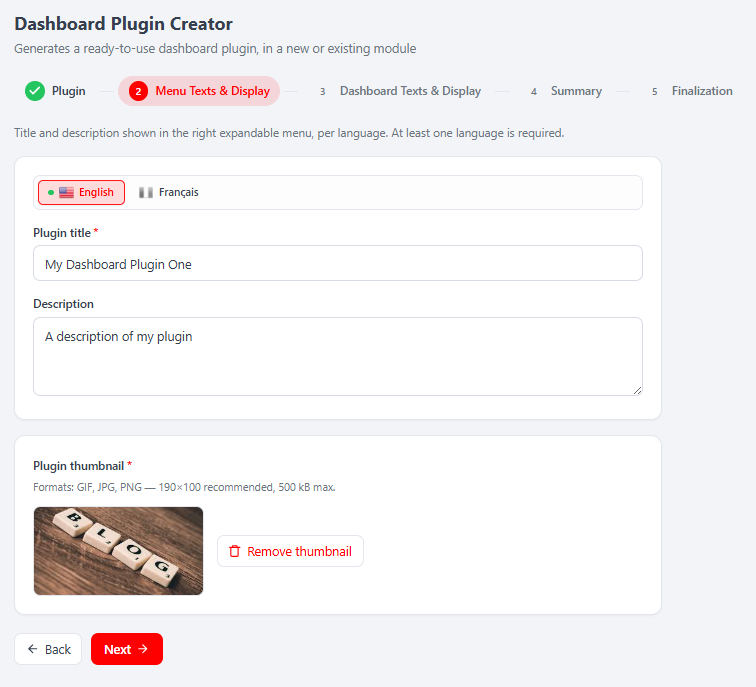
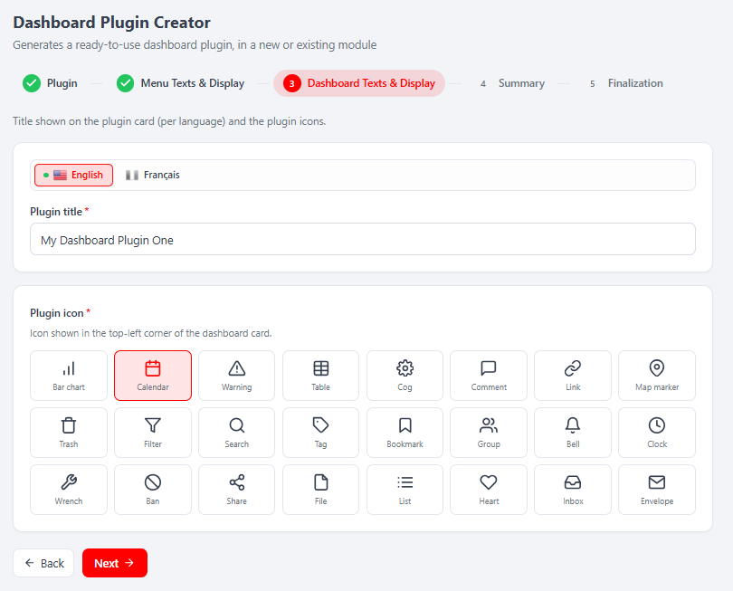
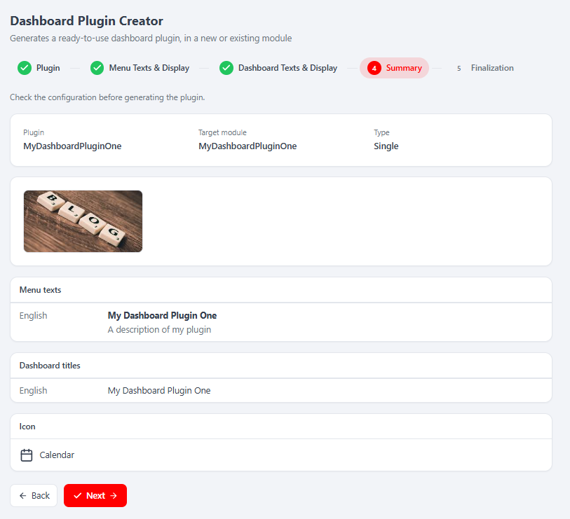
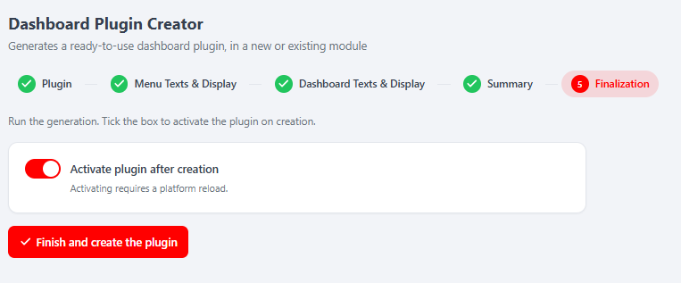

# MelisDashboardPluginCreator (React back-office) — Functional & Technical Documentation (for AI)

> **What this is.** MelisDashboardPluginCreator is a **code-generation assistant**: a **5-step
> wizard** that scaffolds a ready-to-use **dashboard plugin** (the widgets shown on the Melis
> back-office home dashboard) into either a **brand-new module** or an **existing module**. This
> document covers it **in the new React back-office** (`/melis-react`): the module ships a **native
> full-React brick** — a real React wizard calling a `react-api` JSON layer — with a **New / Old
> toggle** that can fall back to the legacy jQuery tool in an iframe. **All the real work stays
> server-side**: validation reuses the legacy Laminas forms, and the generation calls
> `MelisDashboardPluginCreatorService` (which writes PHP files to disk, rewrites `module.config.php`
> / `Module.php` / language files, and activates the module). React is presentation + API calls.
> There is **no legacy MelisAI doc** for this module, so nothing is cross-linked below.
>
> **How this document is organised — two clearly separated parts:**
> - **[Part A — Functional Guide](#part-a--functional-guide)** — for everyday users (and the chat
>   assistant) using the React back-office. Plain language.
> - **[Part B — Technical Reference](#part-b--technical-reference)** — for developers and AI
>   building inside the React UI, with code (brick manifest, endpoints, capabilities).
>
> **Audience**: consumed by the **MelisAI** MCP. **Status**: reviewed 2026-08-19.

---

## 0. Where this lives in the React back-office — read this first

- **Brick kind: native full-React** (not an iframe brick). The wizard is authored in React
  (`ui-react/src/`) and reads/writes through `/melis/react-api/dpc/*` endpoints defined in the
  module. It also keeps a **New / Old toggle**: *Old* renders the legacy tool in an iframe
  (`/melis/react-tool-page?key=melisdashboardplugincreator_tool`), *New* is the React wizard
  (default).
- **Where in the menu.** The tool surfaces under the route derived from its `forwardKey`
  `MelisDashboardPluginCreator/DashboardPluginCreator`; the manifest `route`
  `/melis-core/dashboard-plugin-creator` is the fallback mount. The tool appears **only if the
  module is activated** (modular brick discovery, see §B5).
- **The brick is `persistent`** and **has no sub-tabs** (`subTabs: false`): the wizard is one
  mounted page whose 5 steps are CSS-shown/hidden panes — leaving the tool and coming back loses
  **neither the draft nor the current step**.
- **What "generate" actually does (be honest).** Step 5 is the **only mutating operation**. It
  writes PHP files into `module/`, and — for the *new module* branch — scaffolds an empty module
  via `MelisToolCreatorService::createTool()`, generates the plugin into it, **activates the
  module**, invalidates the module-paths cache and the dashboard-menu cache. Activating requires a
  **platform reload** (the wizard counts down and reloads). This is the sensitive capability
  (`finalization.create`).
- **No coupled `-react.md` sibling to cross-link and no legacy doc.**

---
---

# PART A — Functional Guide

## A1. What you can do with the Dashboard Plugin Creator in the new back-office

- **Scaffold a dashboard plugin** — a widget that shows up on the back-office home dashboard —
  without writing PHP by hand.
- **Choose single vs multi-tab** — a simple one-card plugin, or a multi-tab plugin (2–25 tabs, each
  with its own icon).
- **Target a new or an existing module** — create a fresh module for the plugin, or add the plugin
  into a module you already have.
- **Localise it** — enter the menu title/description and the dashboard-card title **per language**.
- **Pick icons** — a plugin icon (top-left of the card) and, for multi-tab, one icon per tab.
- **Review, then generate** — a read-only summary, then a one-click **Finish and create the plugin**
  (optionally activate it immediately).
- **Compare New vs Old** — switch the whole tool between the React wizard and the classic tool with
  the **New / Old** toggle.

## A2. Finding it in /melis-react

**Where:** open the tool from its left-menu entry (route
`/melis-core/dashboard-plugin-creator`). It opens as a top tab named **Dashboard Plugin Creator**,
with a step bar across the top and the **New / Old** toggle (top-right, next to **Restart**).


*Step 1 (**Plugin**) of the React wizard: title "Dashboard Plugin Creator", subtitle "Generates a ready-to-use dashboard plugin, in a new or existing module", the 5-step bar (1 Plugin · 2 Menu Texts & Display · 3 Dashboard Texts & Display · 4 Summary · 5 Finalization), and the form — **Plugin name** (placeholder "SalesOverview"), **View type** (Single / Multi-tabs), **Plugin destination** (New module / Existing module) — and the **Next** button.*

## A3. Key words explained

- **Dashboard plugin** — a widget/card generated by this tool that appears on the back-office home
  dashboard.
- **Single / Multi-tabs** — the plugin's **View type**: one card, or a card with several tabs (2–25),
  each tab having its own icon.
- **New module / Existing module** — where the generated plugin lives: a fresh module scaffolded for
  it, or a module already on the platform.
- **Thumbnail** — the required preview image of the plugin (GIF/JPG/PNG, ~190×100, ≤500 kB).
- **Plugin icon / tab icon** — the FontAwesome-style plugin icon shown on the card, plus (multi-tab)
  a Glyphicons icon per tab.
- **New / Old** — the two views of the same tool: **New** = React wizard, **Old** = the classic tool
  in an iframe.
- **Restart** — clears the wizard (session draft + temporary thumbnail) and returns to step 1.

## A4. Step 1 — Plugin (name, view type, destination)

You enter the **Plugin name** (e.g. `SalesOverview`), choose the **View type** (**Single** or
**Multi-tabs** — picking Multi-tabs reveals a **number of tabs** field, min/max from context, 2–25),
and choose the **Plugin destination**: **New module** (reveals a **new module name** field, e.g.
`MyDashboards`) or **Existing module** (reveals a **module** dropdown; disabled if you have no
user modules). Clicking **Next** validates this step server-side (reserved PHP keyword, module
already exists, plugin name already taken in the chosen existing module) and advances.

## A5. Step 2 — Menu Texts & Display (localised menu title/description + thumbnail)

Enter, **per language** (a language tab bar with a green dot marking completed languages), the
**Plugin title** and an optional **Description** shown in the right expandable menu. **At least one
language is required.** Below, upload the **Plugin thumbnail** (required; GIF/JPG/PNG, ~190×100,
≤500 kB) — with a preview and **Remove thumbnail**.


*Step 2 (**Menu Texts & Display**): the language tab bar (English / Français), **Plugin title** ("My Dashboard Plugin One") and **Description** ("A description of my plugin") for the active language, then the **Plugin thumbnail** card (formats hint, image preview, **Remove thumbnail**). Back / Next at the bottom.*

## A6. Step 3 — Dashboard Texts & Display (card title + icons)

Enter the **Plugin title shown on the dashboard card**, again **per language**. Then pick the
**Plugin icon** (shown top-left of the card) from an icon grid. If you chose **Multi-tabs** in step 1,
you also pick **one icon per tab** here.


*Step 3 (**Dashboard Texts & Display**): the per-language **Plugin title** (card title), and the **Plugin icon** grid ("Icon shown in the top-left corner of the dashboard card") — Bar chart, Calendar (selected), Warning, Table, Cog, Comment, Link, Map marker, Trash, Filter, Search, Tag, Bookmark, Group, Bell, Clock, Wrench, Ban, Share, File, List, Heart, Inbox, Envelope. Multi-tab plugins add a per-tab icon grid below.*

## A7. Step 4 — Summary (read-only review)

A read-only recap of everything configured: **Plugin** name, **Target module**, **Type**, the
**thumbnail**, the **Menu texts** (per language), the **Dashboard titles** (per language), the plugin
**Icon**, and — multi-tab — the **tab icons**. Nothing is written here; **Next** just advances.


*Step 4 (**Summary**), "Check the configuration before generating the plugin.": Plugin `MyDashboardPluginOne`, Target module `MyDashboardPluginOne`, Type `Single`; the thumbnail; **Menu texts** (English — "My Dashboard Plugin One" / "A description of my plugin"); **Dashboard titles** (English — "My Dashboard Plugin One"); **Icon** (Calendar). Back / Next.*

## A8. Step 5 — Finalization (generate the plugin)

The final step runs the generation. A toggle **Activate plugin after creation** (on by default;
"Activating requires a platform reload") controls whether the generated module is turned on
immediately. Clicking **Finish and create the plugin** writes the plugin to disk; on success you see
a confirmation and, if activation was requested, a countdown that reloads the platform (with a
**Reload now** button as a manual escape and **Create another** to restart the wizard).


*Step 5 (**Finalization**), "Run the generation. Tick the box to activate the plugin on creation.": the **Activate plugin after creation** toggle (on) with the note "Activating requires a platform reload.", and the **Finish and create the plugin** button.*

## A9. Common tasks — "How do I…?"

- **Create a dashboard plugin in a new module** → Step 1: name it, pick **New module** + a module
  name → Step 2: titles + thumbnail → Step 3: card title + icon → Step 4: review → Step 5: **Finish
  and create the plugin** (leave activation on).
- **Add a plugin into an existing module** → Step 1: pick **Existing module** + choose the module.
- **Make a multi-tab plugin** → Step 1: **Multi-tabs** + number of tabs (2–25) → Step 3: pick a tab
  icon for each tab.
- **Start over** → **Restart** (top toolbar) — clears the draft and returns to step 1.
- **Compare with the classic tool** → top-right **New / Old** toggle → **Old** (⚠ opening the legacy
  view resets the wizard draft).

> **Tip:** the wizard is `persistent` — you can leave the tool tab and come back without losing your
> place or your inputs. Switching to **Old** is the one exception (it resets the shared session
> draft); the wizard warns before switching if you have a draft.

---
---

# PART B — Technical Reference

## B1. React presence at a glance

| Item | Value |
|---|---|
| Brick kind | **Native full-React** (5-step wizard, with a New/Old legacy-iframe fallback) |
| Brick id | `dashboard-plugin-creator` (matches `brick.tsx` ⇄ `brick.manifest.json`) |
| Manifest `route` | `/melis-core/dashboard-plugin-creator` (fallback; real mount is the menu-tree route via `forwardKey`) |
| `label` | `Dashboard Plugin Creator` |
| `forwardKey` | `MelisDashboardPluginCreator/DashboardPluginCreator` |
| `melisKey` (manifest / Old-view iframe / rights) | `melisdashboardplugincreator_tool` |
| `entry` | `brick.js` |
| `subTabs` | `false` |
| `persistent` | `true` (wizard kept mounted; steps are CSS panes) |
| Access-guard / capabilities melisKey | `melisdashboardplugincreator_tool` (rights-bearing node — same as manifest) |
| API base | `/melis/react-api/dpc` |
| Generation service | `MelisDashboardPluginCreatorService` (+ `MelisToolCreatorService` for the new-module branch) |
| Activation-gated | Yes (appears iff the module is active / in `config/melis.module.load.php`) |
| Legacy MelisAI doc | none |

## B2. The brick — anatomy

Source in `ui-react/` (Vite **IIFE**, React externalised to the host globals `MelisReact*`, output
to `public/ui-react/brick.js` next to `brick.manifest.json`).

`ui-react/src/brick.tsx` registers ONE routed component under the brick id:
```tsx
import DpcPage from './DpcPage'
window.__melisRegisterBrick?.({ id: 'dashboard-plugin-creator', Component: DpcPage })  // id MUST match the manifest
```

Manifest (`public/ui-react/brick.manifest.json`):
```json
{ "id": "dashboard-plugin-creator", "route": "/melis-core/dashboard-plugin-creator",
  "label": "Dashboard Plugin Creator",
  "forwardKey": "MelisDashboardPluginCreator/DashboardPluginCreator",
  "melisKey": "melisdashboardplugincreator_tool",
  "subTabs": false, "persistent": true, "entry": "brick.js" }
```

React components (`ui-react/src/`):

| File | Role |
|---|---|
| `DpcPage.tsx` | **Wizard container**. Fetches `context` + `state` once on mount, holds the single source of truth (step1/step2/step3, icon, tabIcons, thumbnail, per-step errors), drives the **step bar** and Back/Next, gates each control via `useCaps`, and owns the **New/Old** `mode`. The 5 steps are mounted once and shown/hidden via `<Pane>` (no remount, no refetch). Has a **Restart** button (calls `/dpc/reset`). If `context.blocking` is non-empty (FS not writable) it shows only the blocking notice. |
| `Step1Plugin.tsx` | **Step 1 — Plugin**: name, view type (single/multi), tab count (multi only, `ctx.minTabs`..`ctx.maxTabs`), destination (new/existing module) + new-module name or existing-module select. Business rules validated **server-side**; the component only renders returned messages. |
| `Step2Menu.tsx` | **Step 2 — Menu Texts & Display**: per-language title/description (`LangTabs`), plus the **thumbnail** upload/remove (its own caps `thumbnail.create` / `thumbnail.delete`). Uploads immediately via `/dpc/thumbnail`. |
| `Step3Dashboard.tsx` | **Step 3 — Dashboard Texts & Display**: per-language dashboard-card title, the **plugin icon** grid, and (multi only) one **tab icon** grid per tab. |
| `Step4Summary.tsx` | **Step 4 — Summary**: read-only recap, fetched from `/dpc/summary` on entering the step (`active`). |
| `Step5Finalize.tsx` | **Step 5 — Finalization**: the **Activate** toggle + **Finish and create the plugin** button → `/dpc/generate`; on success shows a countdown that reloads the platform (if activation) with a manual **Reload now**. |
| `ViewToggle.tsx` | The reusable **New (React) / Old (iframe)** toggle (`type ViewMode = 'react' \| 'iframe'`). |
| `dpc-api.ts` | The API client (see §B3) + the TS request/response types (`Context`, `WizardState`, `StepResult`, `Summary`, `GenerateResult`, …). |
| `icons.tsx` | Inline SVG icon set + `fa-…` → SVG mapping (the brick can't load FontAwesome). |
| `ui.tsx` | Self-contained i18n (fr/en from `document.documentElement.lang`), inline styles (theme CSS vars), `Field`, `Pane`, `LangTabs`, `IconGrid`, `Notice`, `Toggle`, buttons, `formatBytes`. |
| `shared/useCaps.ts` | Bridges to the host caps resolver (`window.__melisUseCaps(melisKey)`); default-allow only in standalone dev. |
| `shared/melis-form-errors.tsx` | Unified `FormErrorBanner` + `okNotify`/`koNotify` toasts. |

> **Brick constraint:** the bundle externalises only React to the host globals; it cannot import host
> modules (Tailwind/shadcn/lucide/i18n/FontAwesome), hence inline styles + in-file i18n + inline SVG
> icons.

## B3. React API — endpoints

Routes live in **`config/react-api.php`** (merged via
`MelisDashboardPluginCreator\Module::getConfig()`), controller
**`MelisDashboardPluginCreator\Controller\MelisReactApiDashboardPluginCreatorController`** (invokable
alias `…\MelisReactApiDashboardPluginCreator`). All under `/melis/react-api/dpc`, contract
`{ success, data, error }`. **Validation failure is NOT an HTTP error**: `POST /dpc/step/:step`
returns `{ success:true, data:{ valid:false, errors:{…} } }` so the UI can show per-field messages.

| Method & URL | Action | Purpose |
|---|---|---|
| `GET /dpc/context` | `context` | Preflight (FS-writable check → `blocking[]`), the 5 steps' meta, languages, existing modules, plugin icons + tab icons, tab min/max, thumbnail limits |
| `GET /dpc/state` | `state` | Current wizard state from the shared session → restores the UI (`step1/step2/step3/thumbnail/completedStep`) |
| `POST /dpc/reset` | `reset` | Restart: clears session draft + temporary thumbnail dir (caps `wizard` + `wizard.edit`) |
| `POST /dpc/step/:step` (`:step` = `[1-3]`) | `step` | Validate + persist step 1/2/3 → `{ valid, errors }` (caps `wizard` + `wizard.edit`) |
| `POST /dpc/thumbnail` | `thumbnail` | Multipart upload of the plugin thumbnail (field `dpc_plugin_upload_thumbnail`) → `{ thumbnail }` (caps `thumbnail` + `thumbnail.create`) |
| `POST /dpc/thumbnail/remove` | `thumbnailRemove` | Remove the thumbnail (file + session) → `{ thumbnail: null }` (caps `thumbnail` + `thumbnail.delete`) |
| `GET /dpc/summary` | `summary` | Read-only recap of steps 1→3 + target module + inactive-module flag (caps `summary` + `summary.list`) |
| `POST /dpc/generate` | `generate` | **Generate the plugin** (writes files, optionally scaffolds+activates a new module) → `{ generated, module, plugin, restartRequired, notices }` (caps `finalization` + `finalization.create`) |

Example (from `dpc-api.ts`):
```ts
const BASE = '/melis/react-api/dpc'
// validate + save step 1
await postJson<StepResult>('/step/1', {
  dpc_plugin_name: 'SalesOverview', dpc_plugin_type: 'single',
  dpc_plugin_destination: 'new_module', dpc_new_module_name: 'MyDashboards',
})  // → { valid: true, errors: {} }  (or { valid:false, errors:{ dpc_plugin_name:{label,messages[]} } })

// generate (step 5) — the ONLY mutating call
await postJson<GenerateResult>('/generate', { dpc_activate_plugin: true })
// → { generated:true, module:'MyDashboards', plugin:'SalesOverview', restartRequired:true, notices:[] }
```
Every fetch sends `X-Requested-With: XMLHttpRequest` + `credentials:'same-origin'`.

> **Note on the data/generation layer.** The controller does **not** reimplement the tool's logic:
> - **Validation** rebuilds the legacy Laminas forms from `config/app.tools.php`
>   (`getFormMergedAndOrdered`) — same validators, same messages, same business rules (reserved PHP
>   keyword, module already exists, plugin name/title already taken).
> - **Generation** calls `MelisDashboardPluginCreatorService::generateDashboardPlugin()`; for the
>   *new module* branch it first primes a `melistoolcreator` session and calls
>   `MelisToolCreatorService::createTool()` to scaffold the empty module, then activates the module
>   (`ModulesService::activateModule`) and invalidates the module-paths cache
>   (`config/melis.modules.path.php`) and the dashboard-menu cache.
> - **State** is written into the **same session container** as the legacy tool
>   (`dashboardplugincreator` → `melis-dashboardplugincreator`), because the service reads it in its
>   constructor.
> The legacy **`DashboardPluginCreatorController`** still exists and is what the **Old view** iframe
> renders (`/melis/react-tool-page?key=melisdashboardplugincreator_tool`); its `renderTool…` clears
> the shared session container, which is why switching to Old resets the React draft.

## B4. Capabilities (advanced rights)

Declared in **`config/react.capabilities.php`** under the **rights-bearing** node
`melisdashboardplugincreator_tool` (the same melisKey used by the manifest and the controller's
access guard). `Capabilities::flatten()` turns the tree into dotted strings passed to
`MelisCan(melisKey, cap)` in React (via `useCaps`) and to `denyUnlessCan(cap)` server-side.
Semantics are **default-allow** (an undeclared tool/cap is permitted — legacy roles keep working).

```
melisdashboardplugincreator_tool
├─ tab "wizard"        actions: edit            → configure steps 1→3 (edit = save/validate a step; else read-only)
├─ tab "thumbnail"     actions: create · delete → upload / remove the plugin thumbnail (step 2)
├─ tab "summary"       actions: list            → read the summary (step 4)
└─ tab "finalization"  actions: create          → GENERATE the plugin (step 5) — the sensitive capability
```
Flattened capability strings used in the code: `wizard`, `wizard.edit`, `thumbnail`,
`thumbnail.create`, `thumbnail.delete`, `summary`, `summary.list`, `finalization`,
`finalization.create`.

Every controller action is guarded twice — access first, then the relevant capability:
```php
private const MELIS_KEY = 'melisdashboardplugincreator_tool';
if ($deny = $this->denyUnlessAccess())            { return $deny; }   // auth + MelisCoreRights::canAccess(MELIS_KEY) → 401/403
if ($deny = $this->denyUnlessCan('finalization')) { return $deny; }   // tab cap
if ($deny = $this->denyUnlessCan('finalization.create')) { return $deny; } // action cap
```
On the UI side `DpcPage` derives `canEdit = can('wizard') && can('wizard.edit')`,
`canSummary = can('summary') && can('summary.list')`,
`canGenerate = can('finalization') && can('finalization.create')`; without `wizard.edit` the whole
wizard is **read-only**. Hiding controls is UX only — the server refuses regardless.

## B5. Host integration

- **Discovery / gating.** `GET /melis/react-api/react-modules` lists active modules that ship a
  `brick.manifest.json`; the host (`melis-core/ui-react/src/lib/bricks.ts`) loads `brick.js` (shared
  React globals) and mounts the brick. Removing `MelisDashboardPluginCreator` from
  `config/melis.module.load.php` makes it disappear.
- **Menu → route.** `useNavMenu` maps the `forwardKey`
  `MelisDashboardPluginCreator/DashboardPluginCreator` to the tool's tree route;
  `Component: DpcPage` renders there (manifest `route` `/melis-core/dashboard-plugin-creator` is the
  fallback).
- **No sub-tabs (`subTabs: false`).** The wizard uses its own in-page step bar (`Stepper` in
  `DpcPage`), not the host native sub-tab bar.
- **Persistence.** `persistent: true` → the host mounts the wizard once and never unmounts it;
  leaving the tool tab and returning keeps the current step and all inputs.
- **New/Old toggle.** `DpcPage` mounts the legacy iframe only on the first switch to *Old*
  (`/melis/react-tool-page?key=melisdashboardplugincreator_tool`, `MelisReactOverride`), then keeps
  it `display:none`. It warns before switching if a draft exists (Old resets the shared session), and
  re-reads `/dpc/state` when switching back to *New*.
- **Capabilities bridge.** `shared/useCaps.ts` delegates to `window.__melisUseCaps(melisKey)` (host
  `caps.ts`); the module only declares `react.capabilities.php` and calls `can()`.
- **i18n.** The brick reads `document.documentElement.lang` (session locale set by the host
  `I18nProvider`) and ships an in-file `{fr,en}` dictionary (`ui.tsx`). Server-side error/label
  strings are `tr_…` translation keys resolved by the controller.
- **Generic bits stay in `melis-react-api`.** `CapabilityGuardTrait` + the `Capabilities` resolver
  are generic; the tool's controller/routes/caps live **in this module** (modularity rule).

## B6. Quick code map

```
melis-dashboard-plugin-creator/
├── config/
│   ├── react-api.php            routes (/melis/react-api/dpc…) + invokable → MelisReactApiDashboardPluginCreator
│   ├── react.capabilities.php   melisReactToolCapabilities keyed on melisdashboardplugincreator_tool
│   └── app.tools.php            legacy Laminas forms reused for validation (step1/step2/step3 forms)
├── src/Controller/
│   ├── MelisReactApiDashboardPluginCreatorController.php  context/state/reset/step/thumbnail/summary/generate
│   │                                                       (denyUnlessAccess + denyUnlessCan; reuses legacy forms + service)
│   └── DashboardPluginCreatorController.php               legacy tool → rendered in the Old-view iframe
├── ui-react/                    Vite IIFE brick (React externalised)
│   └── src/  brick.tsx (registers id 'dashboard-plugin-creator') · DpcPage (wizard container)
│            · Step1Plugin · Step2Menu · Step3Dashboard · Step4Summary · Step5Finalize
│            · ViewToggle · dpc-api.ts · icons.tsx · ui.tsx
│            · shared/{useCaps,melis-form-errors}
├── public/ui-react/             brick.js (built) + brick.manifest.json (id/route/label/forwardKey/melisKey/persistent)
└── etc/MelisAI/doc/             MelisDashboardPluginCreator-react.md (this) · images/react/
                                 (no legacy MelisDashboardPluginCreator.md)
```

> Business logic stays server-side: validation via the legacy Laminas forms, generation via
> `MelisDashboardPluginCreatorService` / `MelisToolCreatorService` (writes files, rewrites config,
> activates the module). React = presentation + API calls.

---

## Screenshot index

Filename → content lookup for the MelisAI MCP. All under `./images/react/`.

| Image file | Content |
|---|---|
| `melisdashboardcreator-tool-step1.png` | Wizard **Step 1 — Plugin**: Plugin name, View type (Single/Multi-tabs), Plugin destination (New/Existing module), Next |
| `melisdashboardcreator-tool-step2.png` | Wizard **Step 2 — Menu Texts & Display**: per-language title/description (English/Français) + required Plugin thumbnail (preview, Remove) |
| `melisdashboardcreator-tool-step3.png` | Wizard **Step 3 — Dashboard Texts & Display**: per-language card title + Plugin icon grid (Calendar selected); tab-icon grids for multi-tab |
| `melisdashboardcreator-tool-step4.png` | Wizard **Step 4 — Summary**: read-only recap (Plugin/Target module/Type, thumbnail, Menu texts, Dashboard titles, Icon) |
| `melisdashboardcreator-tool-step5.png` | Wizard **Step 5 — Finalization**: Activate-plugin-after-creation toggle + "Finish and create the plugin" button |

---

*Document for AI consumption (MelisAI MCP) — React back-office of `melisplatform/melis-dashboard-plugin-creator`.
Part A = functional guide for users; Part B = technical reference with examples for developers/AI.
No legacy MelisAI doc exists for this module. Last reviewed 2026-08-19.*
